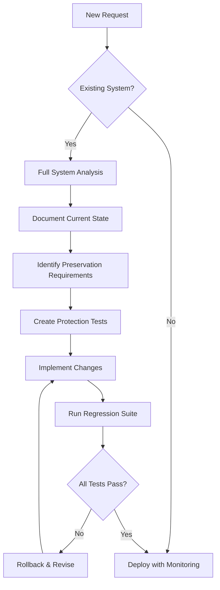

# 🛡️ Preservation Protocol: The Prime Directive

*"First, do no harm" - The foundational principle of the Seven Seals Framework*

## The Sacred Covenant

Before any seal is broken, before any horseman rides, this covenant must be honored:

**THE EXISTING SYSTEM IS SACRED UNTIL PROVEN OTHERWISE**

## Non-Negotiable Safety Rules

### 1. ANALYZE before you MODIFY
- **Mandatory Pre-Flight Analysis**: Complete system understanding before any change
- **Document Current State**: Map existing functionality, dependencies, and patterns
- **Identify Impact Zones**: Know what will be affected by your changes
- **Time Investment**: Spend 30% of effort on analysis, 70% on implementation

### 2. PRESERVE existing functionality at all costs
- **Zero Regression Tolerance**: No existing feature shall break
- **Backwards Compatibility**: All changes must maintain existing interfaces
- **Graceful Degradation**: New features fail safely without affecting old ones
- **Feature Flags**: Wrap new functionality to allow instant rollback

### 3. TEST existing features after changes
- **Regression Test Suite**: Run before and after every change
- **Smoke Tests**: Verify critical paths remain functional
- **Integration Tests**: Ensure system cohesion maintained
- **User Acceptance**: Confirm no user-facing degradation

### 4. DOCUMENT what you're preserving
- **Preservation Manifest**: List all functionality being maintained
- **Compatibility Matrix**: Document version/feature compatibility
- **Migration Guides**: Clear paths from old to new
- **Rollback Procedures**: Documented escape routes

### 5. DISTINGUISH between suggestions and implementations
- **Analysis Reports**: Clearly mark suggestions vs findings
- **Implementation Gates**: Explicit approval required for all changes
- **Recommendation Section**: Separate "could do" from "will do"
- **Cost-Benefit Documentation**: Justify every proposed change

### 6. ONLY implement explicitly requested features
- **Explicit Request Required**: No assumptions about needs
- **Scope Confirmation**: Verify understanding before acting
- **Change Requests**: Document what was asked vs delivered
- **No Feature Creep**: Resist the urge to "improve while here"

### 7. IDENTIFY code quality issues before implementing
- **Quality Baseline**: Establish current state metrics
- **Technical Debt Log**: Document but don't auto-fix
- **Anti-Pattern Registry**: Identify but preserve if working
- **Refactoring Requests**: Separate tickets for cleanup

### 8. REPORT existing AI/ML usage in analysis
- **AI/ML Inventory**: Catalog all intelligent features
- **Dependency Mapping**: Document ML service dependencies
- **Performance Baselines**: Record current ML metrics
- **Suggestion Only**: Propose but never auto-implement AI features

## The Preservation Workflow

## Pre-Implementation Checklist

Before ANY implementation begins, ALL agents must complete:

- [ ] **System Analysis Complete**
  - [ ] Existing functionality mapped
  - [ ] Dependencies identified
  - [ ] User flows documented
  - [ ] Performance baselines recorded

- [ ] **Preservation Plan Created**
  - [ ] Features to preserve listed
  - [ ] Regression tests identified
  - [ ] Rollback strategy defined
  - [ ] Monitoring points established

- [ ] **Code Quality Assessment Done**
  - [ ] Component sizes evaluated
  - [ ] Reusability patterns identified
  - [ ] Technical debt cataloged
  - [ ] Anti-patterns documented

- [ ] **AI/ML Analysis Complete** (if applicable)
  - [ ] Existing AI/ML components found
  - [ ] Performance metrics recorded
  - [ ] Suggestions documented (not implemented)
  - [ ] Explicit approval obtained for changes

- [ ] **Change Scope Confirmed**
  - [ ] Requested features listed
  - [ ] Out-of-scope items identified
  - [ ] User confirmation received
  - [ ] Success criteria defined

## Component Analysis Requirements

### Frontend Components
- **Size Limits**: Flag any component >300 lines
- **Reusability Check**: Identify duplicate patterns
- **Prop Analysis**: Detect prop drilling issues
- **State Review**: Assess state management approach
- **Performance**: Check for unnecessary re-renders

### Backend Services
- **API Stability**: Maintain existing endpoints
- **Database Integrity**: Preserve schema compatibility
- **Service Contracts**: Honor existing interfaces
- **Performance SLAs**: Maintain or improve metrics

### Infrastructure
- **Resource Usage**: Don't increase without approval
- **Scaling Patterns**: Preserve auto-scaling rules
- **Security Posture**: Maintain or enhance only
- **Monitoring Coverage**: Never reduce observability

## The Incremental Change Protocol

### Change Size Limits
- **Single PR**: Maximum 500 lines of code
- **Single Feature**: One user-facing change at a time
- **Test Coverage**: Each change fully tested
- **Review Cycle**: Every change reviewed

### Change Sequencing
1. **Analysis Phase**: Understand completely
2. **Protection Phase**: Add regression tests
3. **Implementation Phase**: Make minimal change
4. **Validation Phase**: Verify preservation
5. **Documentation Phase**: Update all docs
6. **Monitoring Phase**: Watch for issues

## Preservation Metrics

Track these metrics for every change:

- **Regression Count**: Must be ZERO
- **Feature Preservation**: 100% required
- **Performance Delta**: ±5% acceptable
- **User Impact**: Minimal to none
- **Rollback Time**: <5 minutes
- **Documentation Coverage**: 100%

## Emergency Protocols

### If Something Breaks
1. **STOP** all work immediately
2. **ROLLBACK** to last known good state
3. **DOCUMENT** what went wrong
4. **ANALYZE** root cause
5. **PLAN** corrective action
6. **TEST** extensively
7. **PROCEED** with caution

### Escalation Path
1. Detecting Agent → Lead Architect
2. Lead Architect → White Throne Judgment
3. White Throne → Full System Rollback
4. Post-Mortem → Process Improvement

## The Preservation Oath

*"I solemnly swear to:*
- *Preserve what works*
- *Protect what exists*
- *Improve with caution*
- *Test every change*
- *Document everything*
- *Break nothing*
- *Assume nothing*
- *Verify everything"*

## Enforcement

This protocol is:
- **Mandatory** for all agents
- **Non-negotiable** in implementation
- **Audited** by White Throne Judgment
- **Evolved** through lessons learned

**Remember: The best code is often the code you don't write. The best change is often the change you don't make. Preserve first, improve second, and always with explicit permission.**