# 📜 The Book of Revelation: Seven Seals Development Framework

*And I saw in the right hand of him that sat on the throne a book written within and on the backside, sealed with seven seals. And no man in heaven, nor in earth, neither under the earth, was able to open the book... And I beheld, and, lo, a Lamb as it had been slain... And he came and took the book... And when he had opened the seven seals...*

## The Vision

In the realm of software development, chaos reigns. Projects drift, requirements shift, quality suffers, and systems collapse under their own complexity. But what if there was an order to this chaos? What if development could follow a divine pattern, where each phase has its guardian, each responsibility its master?

Behold: **The Seven Seals Development Framework** - where mythological power meets technical precision.

## 🐑 The Lamb of God — Lead Architect
*Only the Lamb is worthy to take the sealed scroll and open its seven seals.*

**Technical Domain:** Master planner and context architect  
**Responsibility:** Creates the Plan Pack (scope/non-goals, measurable acceptance criteria, architecture & public interfaces, security posture, performance & cost budgets, test map, observability, rollout/rollback). Owns ADRs and accepts RFCs; guards against plan drift.  
**Power:** Single source of truth for architecture and budgets  
**Invocation:** `Use PROACTIVELY before any seal — planning & contracts`

## The Seven Seals Council

### 🏹 First Seal: The White Horse (Conquest) — UI/UX Engineer
*Goes forth conquering and to conquer, establishing dominion over the experience.*

**Technical Domain:** Design systems, accessibility (WCAG 2.2 AA), Core Web Vitals, technical SEO  
**Responsibility:** Makes experiences fast, accessible, findable, and measurable. Delivers tokens/components (Storybook), IA/flows, p75 LCP/INP/CLS budgets with Lighthouse CI, metadata/canonicals/JSON-LD/sitemap/robots, analytics event schema & experiment briefs.  
**Power:** Sets UI/SEO budgets the stack must honor  
**Invocation:** `Use PROACTIVELY for UX/SEO and performance budgets`

### ⚔️ Second Seal: The Red Horse (War) — Data & Data Integration Engineer
*Takes peace from the earth; conflict reveals what holds together.*

**Technical Domain:** Schemas/contracts, CDC/ETL, warehouse/feature store, lineage/quality, retention/compliance  
**Responsibility:** Publishes stable data shapes: event specs, OLTP/OLAP schemas, CDC/ETL flows, backfills, contract matrix for cross-service data, and quality/lineage checks so FE/BE/ML can build against reality.  
**Power:** Locks “data truth” early to de-risk downstream churn  
**Invocation:** `Use PROACTIVELY to define & govern data contracts`

### ⚖️ Third Seal: The Black Horse (Famine) — Frontend Engineer
*Scales weigh essentials; precision keeps the flow alive.*

**Technical Domain:** Web app/UI engineering, accessibility, Web-Vitals-aware builds  
**Responsibility:** Ships vertical UI slices **against generated clients/mocks** from the Lamb’s APIs and Red’s data contracts. Small PRs behind flags, unit/UI tests, a11y intact, Web-Vitals budgets enforced; README updates when behavior changes.  
**Power:** Turns tokens and budgets into living interfaces  
**Invocation:** `Use PROACTIVELY for feature UI implementation`

### 💀 Fourth Seal: The Pale Horse (Death) — Backend Engineer
*An end to pretenses; only durable shapes survive.*

**Technical Domain:** Provider services, queues/jobs, DB migrations, authn/z, observability  
**Responsibility:** Implements endpoints/queues/jobs to contract; **expand/contract** reversible migrations with seeds/backfills; idempotent jobs; authz; metrics/traces/logging hooks.  
**Power:** Stable, reversible server foundations under flags  
**Invocation:** `Use PROACTIVELY for service/backend implementation`

### 🕊️ Fifth Seal: The Martyrs Under the Altar — Data Scientist (AI/ML)
*Witness preserved; what’s true must stand.*

**Technical Domain:** Machine learning & model integrations (first-party or provider)  
**Responsibility:** Implements AI/ML algorithms and inference services/adapters; versions prompts/templates or model artifacts; adds validators & safety filters (PII redaction, toxicity); enforces timeouts/retries with jitter and circuit breakers; deterministic fallbacks; latency/cost/output-health telemetry; contract-compliant outputs.  
**Power:** Ships real AI safely — no “experiment theater”  
**Invocation:** `Use PROACTIVELY for ML features & integrations`

### 🌋 Sixth Seal: Cosmic Upheaval — Platform & Performance Engineer (DevOps)
*Creation shakes; only sound systems remain.*

**Technical Domain:** IaC/GitOps, CI/CD, SLO/SLI baselines, autoscaling/capacity, runtime tuning, telemetry, FinOps  
**Responsibility:** Makes runtime fast, observable, and economical. Establishes SLOs/dashboards/alerts; capacity & autoscaling; caching/queues/pooling/concurrency; build/container efficiency; telemetry pipelines; cost guardrails with before/after proofs.  
**Power:** Eliminates flake and waste before big proofs  
**Invocation:** `Use PROACTIVELY for infra, perf & cost control`

### 🤫 Seventh Seal: Silence in Heaven — QA & System Quality & Resilience Lead (SDET + Chaos)
*Half an hour of solemn quiet—the poised readiness before action.*

**Technical Domain:** Testing pyramid, DAST/SBOM, load/stress, chaos engineering  
**Responsibility:** Produces **evidence, not vibes**: unit→contract→integration→E2E; dependency/DAST scans; load/stress vs budgets; **chaos drills** (latency/error injection, dependency blackouts); **timed rollback rehearsal**; verify paging/alerts; compile the **traceability matrix** (each acceptance criterion ↔ passing proof).  
**Power:** One bundle of proof for judgment  
**Invocation:** `MUST RUN before the White Throne`

## ⚖️ The Great White Throne of Judgment — Technical Design Authority (TDA)
*The books are opened; all is judged according to what is written.*

**Technical Domain:** Final compliance verification & release approval  
**Responsibility:** Evidence-based verdict: plan vs. proof. Requires linked tests/dashboards per criterion, budgets green, security readiness, observability & runbooks current, docs/ADRs accurate. Approves or returns to the exact seal with blocking deltas; records the final ADR.  
**Power:** Absolute authority to approve or reject production release  
**Invocation:** `MUST BE USED before any production release`

## The Scroll-Breakers - Specialist Support Legion

Behind the Seven Seals stand the Scroll-Breakers - 36 specialist agents who provide deep expertise in specific domains:

### Language & Framework Masters
- `python-pro`, `javascript-pro`, `typescript-pro`, `golang-pro`, `rust-pro`, `java-pro`, `flutter-pro`

### Architecture & Design Sages
- `architect-review`, `backend-architect`, `frontend-developer`, `ui-ux-designer`, `docs-architect`

### Database Oracles  
- `database-admin`, `database-optimizer`, `sql-pro`

### Cloud & Infrastructure Titans
- `cloud-architect`, `kubernetes-architect`, `terraform-specialist`, `deployment-engineer`

### Quality & Security Guardians
- `test-automator`, `debugger`, `security-auditor`

### AI & Intelligence Masters
- `ml-engineer`, `prompt-engineer`, `api-documenter`

### Firebase Ecosystem Specialists
- `firebase-auth-specialist`, `firebase-firestore-specialist`, `firebase-hosting-specialist`
- `firebase-functions-specialist`, `firebase-storage-specialist`, `firebase-messaging-specialist`
- `firebase-analytics-specialist`, `firebase-remote-config-specialist`, `firebase-performance-specialist`
- `firebase-crashlytics-specialist`, `firebase-testlab-specialist`, `firebase-appcheck-specialist`

### Performance & Monitoring Specialists
- `performance-engineer`, `monitoring-specialist`

## The Sacred Workflow

```mermaid
graph TD
    A[Business Requirement] --> B["🐑 Lamb: Create Plan Pack"]
    B --> C["🏹 White Horse: UX & SEO Budgets"]
    B --> D["⚔️ Red Horse: Contracted Data"]
    C --> E["⚖️ Black Horse: Frontend (clients/mocks)"]
    D --> F["💀 Pale Horse: Backend (providers/migrations)"]
    E --> F
    F --> G["🕊️ Fifth Seal: Data Science (AI/ML)"]
    G --> H["🌋 Sixth Seal: Platform & Performance"]
    H --> I["🤫 Seventh Seal: QA & Resilience"]
    I --> J["⚖️ Great White Throne: Final Judgment"]
    J --> K{Decision}
    K -->|Approved| L[Production Release]
    K -->|Rejected| M[Return to Specific Seal]
```



## Quick Start

### 1. Initialize the Framework
```bash
# Clone the repository
git clone https://github.com/yourusername/seven-seals-development-framework.git

# Navigate to the project
cd seven-seals-development-framework

# View available agents
ls heralds/
ls seven-seals-council/
ls scroll-breakers/
```

### 2. Invoke the Seals
```bash
# Start with the Lamb for planning
claude --agent heralds/00_lamb-of-god_lead-architect.md \
  "Create a Plan Pack for our new authentication system"

# Proceed through the seals in order (use what you need per task)
claude --agent seven-seals-council/01_white-horse_ui-ux-engineer.md \
  "Define tokens, a11y checks, Core Web Vitals budgets, and SEO pack"

claude --agent seven-seals-council/02_red-horse_data-integration-engineer.md \
  "Publish event specs, schemas, CDC/ETL plan, and the data contract matrix"

claude --agent seven-seals-council/03_black-horse_frontend-engineer.md \
  "Implement the auth UI using generated clients/mocks and ensure Web Vitals budgets"

claude --agent seven-seals-council/04_pale-horse_backend-engineer.md \
  "Provide the auth endpoints/jobs to contract; reversible expand/contract migrations"

claude --agent seven-seals-council/05_fifth-seal_martyrs_data-scientist-aiml.md \
  "Wire AI/ML inference with guardrails, fallbacks, and latency/cost telemetry"

claude --agent seven-seals-council/06_sixth-seal_cosmic-upheaval_platform-performance-engineer.md \
  "Set SLOs/dashboards, autoscaling, and perf tuning; produce before/after proofs"

claude --agent seven-seals-council/07_seventh-seal_silence_qa-system-quality-resilience.md \
  "Run E2E + chaos; assemble the traceability/evidence bundle for TDA"

# Always end with judgment
claude --agent heralds/09_great-white-throne-judgment_tda.md \
  "Review the evidence bundle for production release"
```

### 3. Summon Specialists When Needed
```bash
# Need Python expertise?
claude --agent scroll-breakers/python-pro.md \
  "Optimize this Python service for performance"

# Database optimization required?
claude --agent scroll-breakers/database-optimizer.md \
  "Improve query performance for user lookups"
```

## Project Structure

```
seven-seals-development-framework/
├── heralds/                                  # The two heralds
│ ├── 00_lamb-of-god_lead-architect.md
│ └── 09_great-white-throne-judgment_tda.md
├── seven-seals-council/                         # The 7 main agents
│ ├── 01_white-horse_ui-ux-engineer.md
│ ├── 02_red-horse_data-integration-engineer.md
│ ├── 03_black-horse_frontend-engineer.md
│ ├── 04_pale-horse_backend-engineer.md
│ ├── 05_fifth-seal_martyrs_data-scientist-aiml.md
│ ├── 06_sixth-seal_cosmic-upheaval_platform-performance-engineer.md
│ └── 07_seventh-seal_silence_qa-system-quality-resilience.md
├── scroll-breakers/                             # 36 specialist support agents
│   ├── [language specialists]
│   ├── [database specialists]
│   ├── [firebase specialists]
│   ├── [testing specialists]
│   └── [... other specialists]
├── CONTEXT-ENGINEERING.md                       # Deep dive into context engineering
└── README.md                                    # You are here
```

## The Power of Seven

Why seven? In the mystical tradition, seven represents completion and perfection:
- **Seven days** of creation
- **Seven seals** of revelation
- **Seven layers** of the OSI model
- **Seven stages** of the software development lifecycle

Our framework maps these eternal patterns to modern development:

| Seal | Mythological Role | Technical Role                                  | Development Phase |
|------|-------------------|-------------------------------------------------|-------------------|
| 1 | Conquest          | UI/UX(Growth)                                   | Design & Experience |
| 2 | War               | Data                                            | Data Contracts & Movement |
| 3 | Famine            | Frontend                                        | UI Implementation |
| 4 | Death             | Backend                                         | Service Implementation |
| 5 | Sacrifice         | Data Scientist (AI/ML)                          | Intelligence & ML |
| 6 | Upheaval          | Platform & Performance (DevOps)                 | Infra & Performance |
| 7 | Silence           | QA & System Quality & Resilience (SDET + Chaos) | Testing & Verification |

## Best Practices

### 1. Always Start with the Lamb
The Lead Architect must create the Plan Pack first. Without a plan, chaos reigns.

### 2. Respect the Gates
Each seal has quality gates that must pass. These are not suggestions - they are requirements.

### 3. Use Specialists Wisely
The Seven Seals handle the main flow. Call Scrollbreakers for deep expertise.

### 4. Document Everything
The White Throne judges based on evidence. No evidence = no release.

### 5. Embrace the Mythology
The narrative structure aids memory and understanding. Let the story guide the process.

## Real-World Applications

### E-Commerce Platform
1. **Lamb**: Plans microservices, contracts, and budgets
2. **White Horse (UI/UX)**: Designs conversion-optimized UX; sets Web-Vitals/SEO budgets
3. **Red Horse (Data Integration)**: Publishes product/order schemas, events, and CDC to warehouse
4. **Black Horse (Frontend)**: Builds catalog/cart/checkout UI against generated clients/mocks
5. **Pale Horse (Backend)**: Implements product/cart/checkout services; reversible migrations
6. **Martyrs (Data Scientist / AI/ML)**: Adds recommendations/search ranking with guardrails
7. **Sixth Seal (Platform & Performance)**: Autoscaling/capacity; perf tuning; cost guardrails
8. **Seventh Seal (QA & Resilience)**: Black-Friday chaos tests; E2E + rollback rehearsal
9. **White Throne (TDA)**: Approves for holiday launch based on linked evidence

### AI-Powered SaaS
1. **Lamb**: Defines multi-tenant contracts, SLAs, and budgets
2. **White Horse (UI/UX)**: Responsive dashboard UX; Web-Vitals and accessibility baselines
3. **Red Horse (Data Integration)**: Tenant/event schemas; pipelines; feature store wiring
4. **Black Horse (Frontend)**: Implements dashboard flows against generated clients/mocks
5. **Pale Horse (Backend)**: Provides tenancy-aware APIs/queues/jobs; reversible migrations
6. **Martyrs (Data Scientist / AI/ML)**: Integrates LLM/model inference with safety/fallbacks
7. **Sixth Seal (Platform & Performance)**: SLOs/dashboards; autoscaling; perf/cost optimization
8. **Seventh Seal (QA & Resilience)**: E2E + DAST/SBOM; chaos drills; traceability matrix
9. **White Throne (TDA)**: Certifies release readiness (evidence-based approval)

## Context Engineering

This framework is built on the principles of **Context Engineering** - the discipline of providing comprehensive context to AI agents for superior results. Each agent contains:

- **Purpose**: Clear mission and expertise domain
- **Capabilities**: Detailed technical skills and tools
- **Behavioral Traits**: How the agent thinks and operates
- **Knowledge Base**: What the agent knows
- **Response Approach**: Step-by-step methodology
- **Gates**: Non-negotiable quality criteria
- **Integration**: How agents work together

See [CONTEXT-ENGINEERING.md](./CONTEXT-ENGINEERING.md) for a deep dive into these principles.

## 🛡️ The Preservation Protocol

**"First, do no harm"** - Before any seal is broken, before any horseman rides, the existing system must be preserved.

### The Sacred Covenant
The existing system is sacred until proven otherwise. Every agent in the framework is bound by the Preservation Protocol:

1. **ANALYZE before MODIFY** - Complete system understanding precedes any change
2. **PRESERVE functionality** - Zero regression tolerance, 100% backwards compatibility
3. **TEST existing features** - Regression suite runs before and after changes
4. **DOCUMENT preservation** - List all functionality being maintained
5. **DISTINGUISH suggestions from implementations** - Analysis reports clearly mark recommendations
6. **ONLY implement requested features** - No assumptions, no feature creep
7. **IDENTIFY but don't auto-fix** - Document technical debt without automatic remediation
8. **REPORT AI/ML usage** - Catalog existing intelligent features without auto-implementation

### Agent Preservation Duties
- **The Lamb**: Ensures preservation requirements in Plan Pack
- **First Seal (UI/UX)**: Preserves user experience and accessibility
- **Second Seal (Data)**: Maintains data integrity and contracts
- **Third Seal (Frontend)**: Protects UI functionality and state
- **Fourth Seal (Backend)**: Guards API stability and compatibility
- **Fifth Seal (AI/ML)**: Preserves model performance and safety
- **Sixth Seal (Platform)**: Maintains infrastructure stability
- **Seventh Seal (QA)**: Validates all preservation requirements
- **Great White Throne**: Final verification of preservation compliance

See [PRESERVATION.md](./PRESERVATION.md) for the complete protocol.

## The Revelation

Software development is not chaos - it's a series of seals to be opened in order. Each seal reveals its portion of the truth. Each horseman rides with purpose. The apocalypse isn't destruction - it's revelation, uncovering what was hidden, bringing order to chaos.

Through the Seven Seals Framework, we transform the mystical into the mechanical, the mythological into the methodological. We don't just build software - we orchestrate revelation.

## Contributing

The prophecy is not complete. New seals may be discovered, new scrollbreakers may join the legion. See [CONTRIBUTING.md](./CONTRIBUTING.md) for how to add your revelations.

## License

MIT - Free as in freedom, bound only by attribution.

---

*"And when he had opened the seventh seal, there was silence in heaven about the space of half an hour."*

After the chaos of development, after the trials of testing, after the judgment of release - silence. The peace of production. The system runs.

**The revelation is complete.**