# 📜 The Book of Revelation: Seven Seals Development Framework

*And I saw in the right hand of him that sat on the throne a book written within and on the backside, sealed with seven seals. And no man in heaven, nor in earth, neither under the earth, was able to open the book... And I beheld, and, lo, a Lamb as it had been slain... And he came and took the book... And when he had opened the seven seals...*

## The Vision

In the realm of software development, chaos reigns. Projects drift, requirements shift, quality suffers, and systems collapse under their own complexity. But what if there was an order to this chaos? What if development could follow a divine pattern, where each phase has its guardian, each responsibility its master?

Behold: **The Seven Seals Development Framework** - where mythological power meets technical precision.

## The Seven Seals Council

### 🐑 First Seal: The Lamb of God - Lead Architect
*Only the Lamb is worthy to open the seals and reveal the plan.*

**Technical Domain:** Master planner and context architect  
**Responsibility:** Creates comprehensive Plan Packs, owns ADRs, defines contracts  
**Power:** Single source of truth for all architectural decisions  
**Invocation:** `Use PROACTIVELY for project planning and architecture`

### 🏹 Second Seal: The White Horse (Conquest) - Growth UX Engineer  
*Goes forth conquering and to conquer, establishing dominion over user experience.*

**Technical Domain:** Design systems, accessibility, Core Web Vitals, SEO  
**Responsibility:** Makes experiences fast, accessible, findable, and persuasive  
**Power:** Conquers the frontend realm with measurable impact  
**Invocation:** `Use PROACTIVELY for UI/UX and performance optimization`

### ⚔️ Third Seal: The Red Horse (War) - Full-Stack Implementation
*Takes peace from the earth, bringing conflict to chaos through disciplined implementation.*

**Technical Domain:** End-to-end feature development across all stack layers  
**Responsibility:** Ships vertical slices with comprehensive testing  
**Power:** Transforms plans into working software  
**Invocation:** `Use PROACTIVELY for feature implementation`

### ⚖️ Fourth Seal: The Black Horse (Famine) - Applied AI/ML Engineer
*Holds the scales, weighing every token, optimizing every inference.*

**Technical Domain:** LLMs, vector databases, ML models, intelligent features  
**Responsibility:** Implements AI with safety guardrails and cost controls  
**Power:** Brings intelligence while preventing hallucination and waste  
**Invocation:** `Use PROACTIVELY for AI integration and ML pipelines`

### 💀 Fifth Seal: The Pale Horse (Death) - Platform & Performance Engineer
*Death rides, and Hades follows, bringing an end to inefficiency and downtime.*

**Technical Domain:** DevOps, IaC, CI/CD, observability, FinOps  
**Responsibility:** Makes systems fast, reliable, and economical  
**Power:** Kills latency, eliminates waste, ensures resilience  
**Invocation:** `Use PROACTIVELY for infrastructure and deployment`

### 🌋 Sixth Seal: Cosmic Upheaval - System Quality & Resilience Lead
*The earth quakes, the sun darkens, stars fall - only quality survives the chaos.*

**Technical Domain:** Testing pyramid, security validation, chaos engineering  
**Responsibility:** Proves systems work and fail safely under stress  
**Power:** Shakes the system to expose what stands and what collapses  
**Invocation:** `Use PROACTIVELY for test automation and resilience`

### ⚖️ Seventh Seal: The Great White Throne - Technical Design Authority
*The books are opened, and all are judged according to what is written.*

**Technical Domain:** Final compliance verification and release approval  
**Responsibility:** Judges if reality matches the plan  
**Power:** Absolute authority to approve or reject production release  
**Invocation:** `MUST BE USED before any production release`

## The Scrollbreakers - Specialist Support Legion

Behind the Seven Seals stand the Scrollbreakers - 24 specialist agents who provide deep expertise in specific domains:

### Language Masters
- `python-pro`, `javascript-pro`, `typescript-pro`, `golang-pro`, `rust-pro`, `java-pro`

### Database Oracles  
- `database-admin`, `sql-pro`, `database-optimizer`

### Quality Guardians
- `test-automator`, `debugger`, `security-auditor`

### Infrastructure Titans
- `terraform-specialist`, `kubernetes-architect`, `deployment-engineer`

### Intelligence Weavers
- `ml-engineer`, `prompt-engineer`

### Architecture Sages
- `architect-review`, `backend-architect`, `cloud-architect`

### Interface Artisans
- `frontend-developer`, `ui-ux-designer`

### Knowledge Scribes
- `api-documenter`, `docs-architect`

## The Sacred Workflow

```mermaid
graph TD
    A[Business Requirement] --> B[🐑 Lamb: Create Plan Pack]
    B --> C[🏹 White Horse: Design UX/Performance]
    B --> D[⚔️ Red Horse: Implement Features]
    B --> E[⚖️ Black Horse: Add Intelligence]
    C --> D
    D --> F[💀 Pale Horse: Deploy & Optimize]
    E --> F
    F --> G[🌋 Sixth Seal: Test & Chaos]
    G --> H[⚖️ White Throne: Final Judgment]
    H --> I{Decision}
    I -->|Approved| J[Production Release]
    I -->|Rejected| K[Return to Specific Seal]
```



## Quick Start

### 1. Initialize the Framework
```bash
# Clone the repository
git clone https://github.com/yourusername/book-of-revelation.git

# Navigate to the project
cd seven-seals-development-framework

# View available agents
ls seven-seals-council/
ls scrollbreakers/
```

### 2. Invoke the Seals
```bash
# Start with the Lamb for planning
claude --agent seven-seals-council/01_lamb-of-god_lead-architect.md \
  "Create a Plan Pack for our new authentication system"

# Continue with implementation
claude --agent seven-seals-council/03_red-horse-war_full-stack-implementation.md \
  "Implement the authentication API according to the Plan Pack"

# Always end with judgment
claude --agent seven-seals-council/07_great-white-throne-judgment_tda.md \
  "Review the authentication system for production release"
```

### 3. Summon Specialists When Needed
```bash
# Need Python expertise?
claude --agent scrollbreakers/python-pro.md \
  "Optimize this Python service for performance"

# Database optimization required?
claude --agent scrollbreakers/database-optimizer.md \
  "Improve query performance for user lookups"
```

## Project Structure

```
book-of-revelation/
├── seven-seals-council/        # The 7 main agents
│   ├── 01_lamb-of-god_lead-architect.md
│   ├── 02_white-horse-conquest_growth-ux-engineer.md
│   ├── 03_red-horse-war_full-stack-implementation.md
│   ├── 04_black-horse-famine_applied-aiml-engineer.md
│   ├── 05_pale-horse-death_platform-performance-engineer.md
│   ├── 06_sixth-seal-cosmic-upheaval_system-quality-and-resilience.md
│   └── 07_great-white-throne-judgment_tda.md
├── scrollbreakers/             # 24 specialist support agents
│   ├── [language specialists]
│   ├── [database specialists]
│   ├── [testing specialists]
│   └── [... other specialists]
├── CONTEXT-ENGINEERING.md      # Deep dive into context engineering
└── README.md                   # You are here
```

## The Power of Seven

Why seven? In the mystical tradition, seven represents completion and perfection:
- **Seven days** of creation
- **Seven seals** of revelation  
- **Seven layers** of the OSI model
- **Seven stages** of the software development lifecycle

Our framework maps these eternal patterns to modern development:

| Seal | Mythological Role | Technical Role | Development Phase |
|------|------------------|----------------|-------------------|
| 1 | Revelation | Architecture | Planning |
| 2 | Conquest | UX/Growth | Design |
| 3 | War | Implementation | Development |
| 4 | Famine | AI/ML | Intelligence |
| 5 | Death | Platform | Infrastructure |
| 6 | Upheaval | Quality | Testing |
| 7 | Judgment | Authority | Release |

## Context Engineering

This framework is built on the principles of **Context Engineering** - the discipline of providing comprehensive context to AI agents for superior results. Each agent contains:

- **Purpose**: Clear mission and expertise domain
- **Capabilities**: Detailed technical skills and tools
- **Behavioral Traits**: How the agent thinks and operates
- **Knowledge Base**: What the agent knows
- **Response Approach**: Step-by-step methodology
- **Gates**: Non-negotiable quality criteria
- **Integration**: How agents work together

See [CONTEXT-ENGINEERING.md](./CONTEXT-ENGINEERING.md) for a deep dive into these principles.

## Best Practices

### 1. Always Start with the Lamb
The Lead Architect must create the Plan Pack first. Without a plan, chaos reigns.

### 2. Respect the Gates
Each seal has quality gates that must pass. These are not suggestions - they are requirements.

### 3. Use Specialists Wisely
The Seven Seals handle the main flow. Call Scrollbreakers for deep expertise.

### 4. Document Everything
The White Throne judges based on evidence. No evidence = no release.

### 5. Embrace the Mythology
The narrative structure aids memory and understanding. Let the story guide the process.

## Real-World Applications

### E-Commerce Platform
1. **Lamb**: Plans microservices architecture
2. **White Horse**: Designs conversion-optimized UX
3. **Red Horse**: Implements product catalog and cart
4. **Black Horse**: Adds recommendation engine
5. **Pale Horse**: Sets up auto-scaling infrastructure
6. **Sixth Seal**: Chaos tests Black Friday scenarios
7. **White Throne**: Approves for holiday season launch

### AI-Powered SaaS
1. **Lamb**: Defines API contracts and budgets
2. **White Horse**: Creates responsive dashboard
3. **Red Horse**: Builds multi-tenant backend
4. **Black Horse**: Integrates LLM with guardrails
5. **Pale Horse**: Implements cost optimization
6. **Sixth Seal**: Validates security and compliance
7. **White Throne**: Certifies SOC2 readiness

## The Revelation

Software development is not chaos - it's a series of seals to be opened in order. Each seal reveals its portion of the truth. Each horseman rides with purpose. The apocalypse isn't destruction - it's revelation, uncovering what was hidden, bringing order to chaos.

Through the Seven Seals Framework, we transform the mystical into the mechanical, the mythological into the methodological. We don't just build software - we orchestrate revelation.

## Contributing

The prophecy is not complete. New seals may be discovered, new scrollbreakers may join the legion. See [CONTRIBUTING.md](./CONTRIBUTING.md) for how to add your revelations.

## License

MIT - Free as in freedom, bound only by attribution.

---

*"And when he had opened the seventh seal, there was silence in heaven about the space of half an hour."*

After the chaos of development, after the trials of testing, after the judgment of release - silence. The peace of production. The system runs.

**The revelation is complete.**